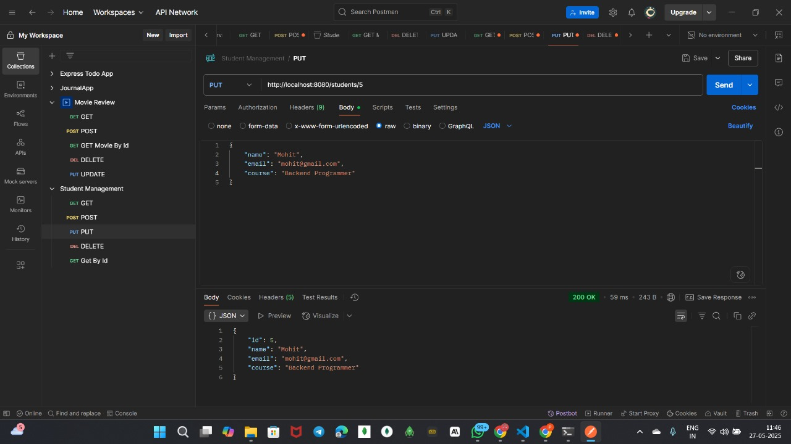

# Student Management API

A RESTful API built with Spring Boot for managing student records with MYSQL database integration.

## Features
 1. CRUD Operations: Create, Read, Update and Delete student records
 2. Database Integration: MYSQL database with JPA/Hibernate
 3. REST API: RESTful design principles with JSON responses


## Tech Stack
 1. Java 24
 2. Spring Boot 3.2.0
 3. Spring Data JPA
 4. MYSQL 8+
 5. Maven
 6. Spring Boot DevTool 

## Installation
 1. Clone the repository
 ```
    git clone https://github.com/prathameshkaratkar/Student-Management.git
    cd Student-Management

 ```
 2. Create MYSQL Database
 ```
    CREATE DATABASE student_management;
 ```
 3. Install Dependencies
 ```
    mvn clean install
 ```
 4. Configure with MYSQL credentials

## Running the Application
 1. Using Maven
 ```
 mvn spring-boot:run
 ```
 2. Using IDE
 ```
 StudentManagementApplication.java
 ```

## API Endpoints
 ```
 GET -> students
 GET -> students/{id}
 POST -> students
 PUT -> students/{id}
 DELETE -> students/{id}
 ```

Student JSON Structure
```
{
"name" : "prathamesh",
"email": "prathamesh@gmail.com",
"course": "Full Stack Java Development"
}
```

## Screenshots:





## Database Configuration
```
spring.datasource.url=jdbc:mysql://localhost:3306/student_management
spring.datasource.username=root
spring.datasource.password=your_password
spring.jpa.hibernate.ddl-auto=update
spring.jpa.database-platform=org.hibernate.dialect.MYSQL8Dialect
spring.jpa.show-sql=true

```

## Testing with Postman
### Setup Postman Collection
```
1. Open Postman
2. Create a new collection named "Student Management"
3. Set base URL as http://localhost:8080/students
```

### Test Cases to Execute
#### 1. POST /students - Create Student
#### 2. GET /students - Get All Students
#### 3. GET /students/{id} - Get Student by ID
#### 4. PUT /students/{id} - Update Student 
#### 5. DELETE /students/{id} - Delete Student


## Contribution
1. Fork the repository
2. Create a feature branch
3. Make your changes
4. Add tests
5. Submit a pull request